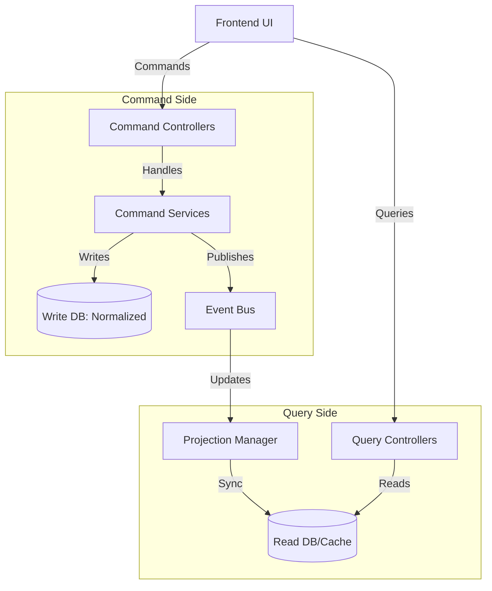

# ForgeFit Backend Architecture Design (Spring Boot + CQRS)

This document outlines the technical architecture for the ForgeFit backend, utilizing **Command Query Responsibility Segregation (CQRS)** to handle the high volume of tracking data and social interactions efficiently.

## 1. Technical Stack
- **Framework**: Spring Boot 3.x
- **Language**: Java 17+
- **CQRS Implementation**: 
    - **Commands**: Spring Data JPA (PostgreSQL) for transactional writes.
    - **Queries**: Read-optimized Projections (PostgreSQL views or Redis) for lightning-fast reads.
    - **Messaging**: Spring Application Events (for internal synchronization) or Kafka/RabbitMQ (for scale).
- **Security**: Spring Security + JWT
- **Caching**: Redis (Query side caching for leaderboards)

---

## 2. Directory Structure (CQRS Pattern)
```text
/backend
├── src/main/java/com/forgefit
│   ├── command/               # Write Side (State Changes)
│   │   ├── api/               # CommandControllers (POST/PUT/DELETE)
│   │   ├── model/             # Write Entities (JPA)
│   │   ├── service/           # Command Handlers
│   │   └── repository/        # Write-only Repositories
│   ├── query/                 # Read Side (Display Logic)
│   │   ├── api/               # QueryControllers (GET)
│   │   ├── model/             # Read Models / DTOs / Projections
│   │   ├── service/           # Query Handlers (View assembly)
│   │   └── repository/        # Read-only Repositories
│   ├── shared/                # Common Value Objects, Enums, Utils
│   ├── security/              # Auth logic
│   └── config/                # App configuration
└── pom.xml
```

---

## 3. CQRS Implementation Strategy

### Command Side (Writes)
- **Responsibility**: Validate business rules and update system state.
- **Example**: `LogWorkoutCommand`
    1. User submits workout via `/api/v1/commands/workout`.
    2. `WorkoutCommandHandler` validates the user and duration.
    3. Saves to `user_workout_logs` table (Write DB).
    4. Publishes `WorkoutCompletedEvent`.

### Query Side (Reads)
- **Responsibility**: Return denormalized, ready-to-display data.
- **Example**: `UserFeedQuery`
    1. `FeedQueryHandler` listens for `WorkoutCompletedEvent`.
    2. Updates a denormalized `activity_feed` view or Redis cache.
    3. User requests `/api/v1/queries/feed`.
    4. Data is returned directly from the optimized read-model without complex joins.

---

## 4. Key API Endpoints (Split by Responsibility)

### Commands (Writes)
| Endpoint | Method | Responsibility |
| :--- | :--- | :--- |
| `/api/v1/commands/auth/register` | `POST` | Account creation |
| `/api/v1/commands/progress/metabolic` | `POST` | Log daily stats |
| `/api/v1/commands/training/complete` | `POST` | Submit workout log (triggers events) |

### Queries (Reads)
| Endpoint | Method | Responsibility |
| :--- | :--- | :--- |
| `/api/v1/queries/dashboard/radar` | `GET` | Performance Radar data |
| `/api/v1/queries/training/catalog`| `GET` | Filtered workout exploration |
| `/api/v1/queries/community/feed` | `GET` | Social activity feed |

---

## 5. Persistence Overview
1. **Write DB (PostgreSQL)**: Normalized schema for data integrity (Users, Exercises, Workouts).
2. **Read Model**: 
    - **Database Views**: For the "Training Consistency" heatmap.
    - **Redis**: For the "Global Leaderboard" (sorted sets for O(log N) ranking).

---

## 6. CQRS Architecture Diagram

